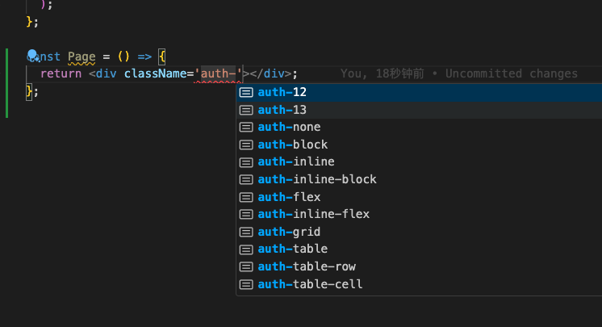

# tailwind-rabc

通过 tailwindcss 解决 rabc 在前端控制元素颗粒度展示的方案

## 使用

1. 安装
   `npm i tailwind-rabc`

2. 配置tailwind.config.js

   ```js
   /** filename="tailwind.config.js" */
   const rabc = require("tailwind-rabc");
   /** @type {import('tailwindcss').Config} */
   module.exports = {
     content: ["./src/**/*.{js,ts,jsx,tsx}"],
     darkMode: ["selector", '[data-mode="dark"]'],
     corePlugins: {
       // Avoid conflicts with antd
       preflight: false,
     },
     plugins: [
       // require('@tailwindcss/typography'),
       // require('@tailwindcss/aspect-ratio'),
       // require('@tailwindcss/forms'),
       rabc.plugin({
         rabcCode: ["12", "13"], // 系统预设的 权限code, 可以是string[] 或者 Record<string, string[]>
         // rabcCode: { manager: ['12', '13'], admin: ['1', '12', '13']}
         mountSelector: "div", // 挂载的元素， 默认是 body， 这个是当前用户权限数据挂元素的css选择器
         type: "data", // 挂载类型。默认 data,可以是class， 会体现在mountSelector
       }),
     ],
     theme: {},
   };
   ```

3. 使用

a：在对应权限控制元素

```tsx
// filename="page.tsx"
// rabcCode: ["12", "13"] 中的code
<div className="auth-12"></div>
<div className="role-manager"></div>

// 如果是多个role
<div className="auth-12 auth-13"></div>

// 控制元素的显示display
<div className="auth-12 auth-13 auth-flex"></div>

```

b: 挂在用户权限数据

```tsx
// filename="App.tsx"
import { mountRabc } from "tailwind-rabc";
const ref = useRef<HTMLDivElement>(null);
// ...
// 这里元素需要和mountSelector 对应上
const yourAccountAuth = ["12"];
// const yourAccountAuth = { manager: ['12', '13']}; 如果只有一个role manager 可以跟一个空的[]
useEffect(() => {
  if (ref && ref.current) {
    mountRabc(yourAccountAuth, ref.current);
  }
}, [ref]);
// ...
return <div ref={ref}></div>;
```

## 说明

1 . 通过 tailwindcss 的插件来解决 rabc 在前端控制元素颗粒度展示的方案 vscode 插件会根据配置的权限进行提示


2: class 写法如下
角色

```tsx
"role-yourRoleCode"; // 角色
```

权限

```tsx
"auth-yourAuthCode"; // 权限
```

命中权限后的样式

```tsx
"auth-display";
```

display 可是：
'none',
'block',
'inline',
'inline-block',
'flex',
'inline-flex',
'grid',
'table',
'table-row',
'table-cell',
